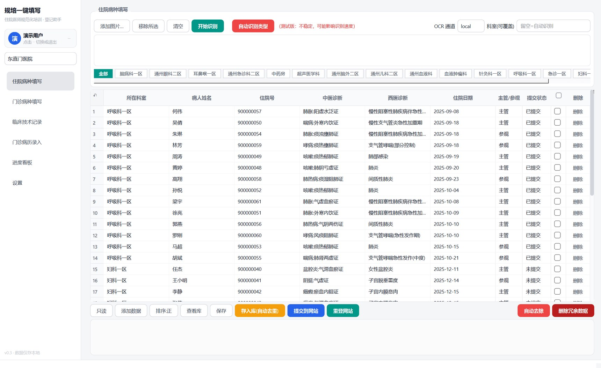
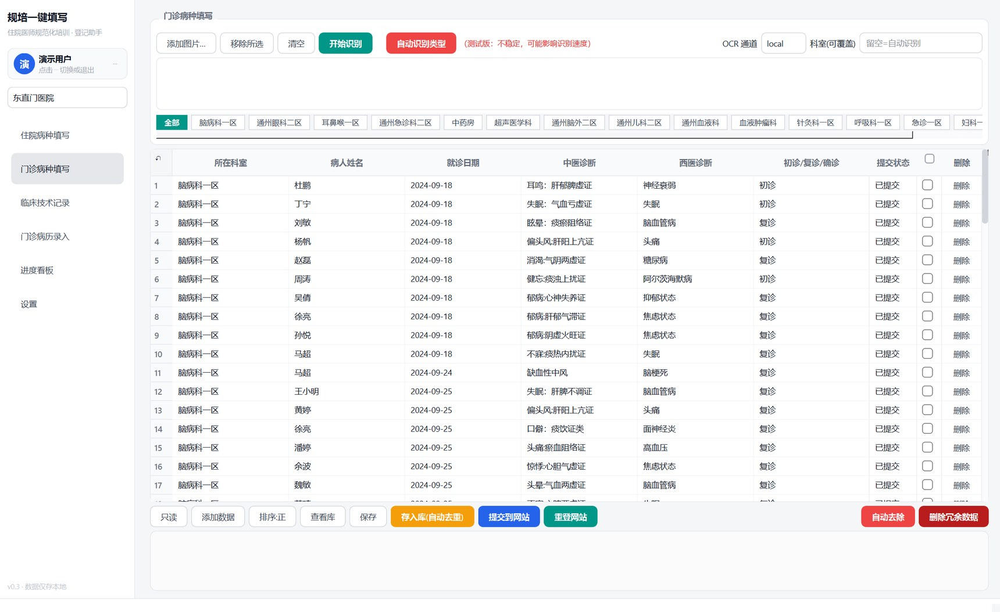
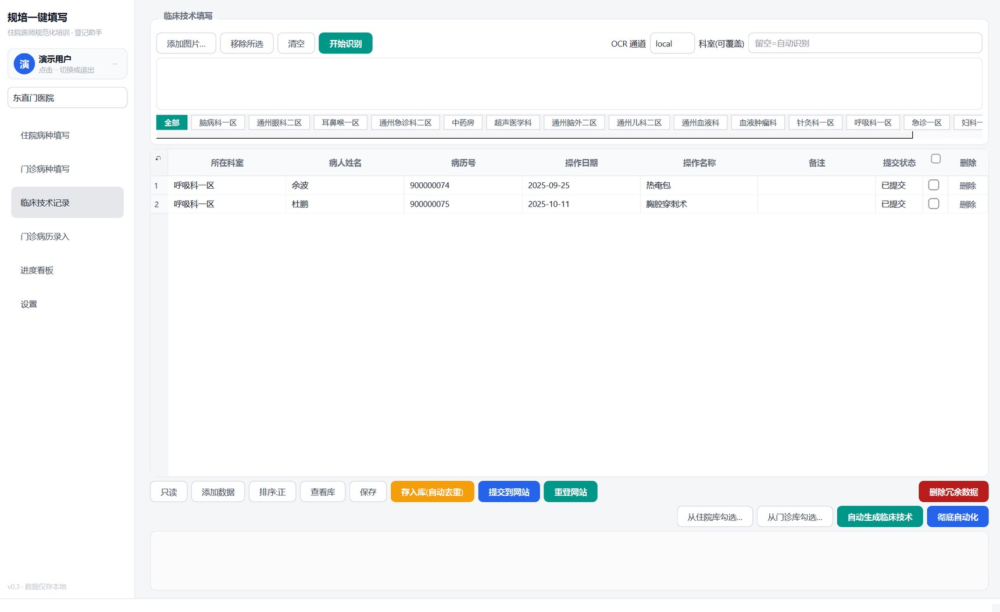
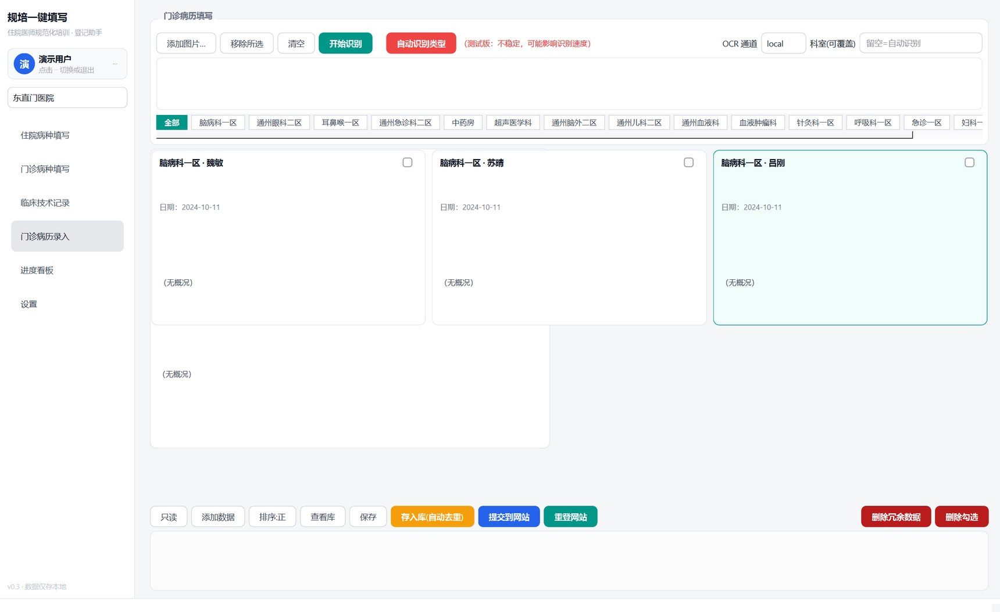
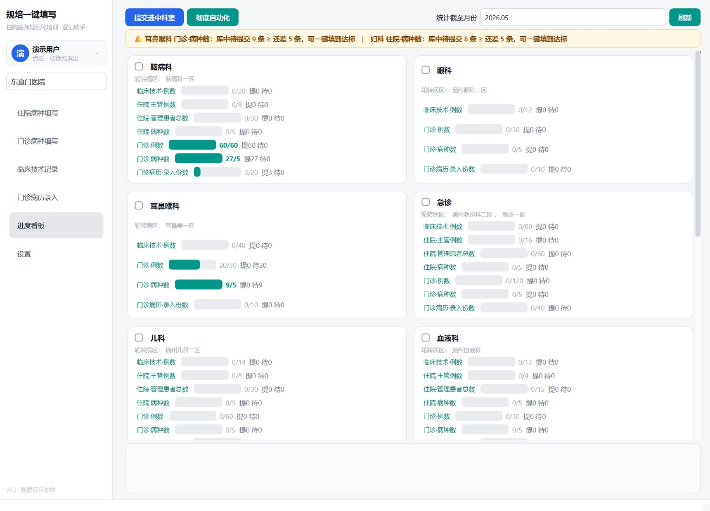
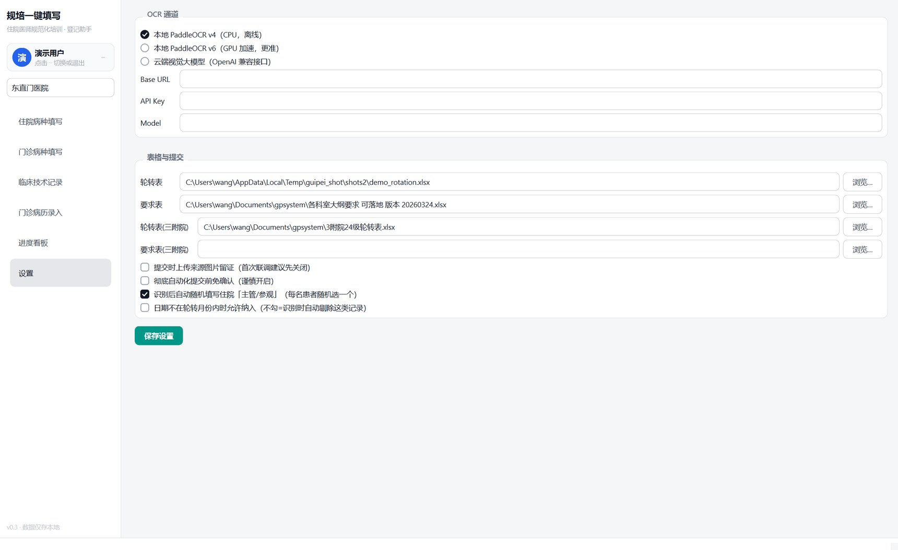
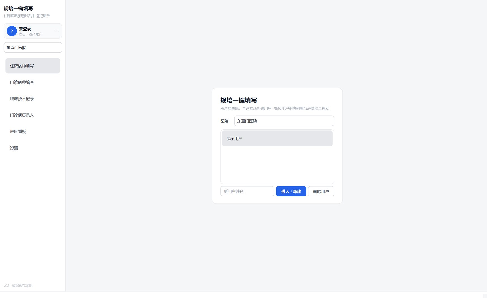

# 规培助手 V1.2.0（by dave）

**把「拍照 → 识别 → 核对 → 批量提交」这条每天要重复走的流程，压缩成点几下鼠标**（本程序为测试版程序，如有 bug 反馈可按下方联系方式提交）。

支持北京中医药大学**东直门医院**与**第三附属医院**两套 HIS 版式。
识别在本机完成，病例库是你自己电脑上的 Excel 文件，不上传任何服务器。

[**⬇️ 下载安装包**](https://github.com/daveandm/beijingtcmguipeiionestep/releases/latest) ·
[安装说明](https://github.com/daveandm/beijingtcmguipeiionestep/releases/download/v1.2.0/Install-Guide.txt) ·
[使用说明](https://github.com/daveandm/beijingtcmguipeiionestep/releases/download/v1.2.0/User-Manual.txt) ·
[图文教程](https://github.com/daveandm/beijingtcmguipeiionestep/releases/download/v1.2.0/Quick-Start-Tutorial.docx)

> **建议使用前务必提前阅读图文教程。** 为保护患者隐私，具体住院病种及门诊病种等拍摄要求示例图未收录，
> 下方界面图中的患者姓名与住院号也已替换为示例数据。
> 需要示例图、更详细的操作示意，或想看具体视频使用教程，可**微信联系 dave**，或在**提瓦特找 109858638**。



---

## 界面一览

左侧六个页面就是完整的工作流：**三个录入页 → 一个病历页 → 看板 → 设置**。

### 住院病种填写

住院病人列表的照片丢进去，自动拆成「姓名 / 住院号 / 中医诊断 / 西医诊断 / 住院日期」。
顶部科室 chips 一点即筛选；底部按钮对应「存入库 → 提交到网站」。


### 门诊病种填写

门诊列表版式不同（多一列「初诊/复诊/确诊」、日期取就诊时间），单独一套识别规则。



### 临床技术记录

可以「从住院库勾选」「从门诊库勾选」复用已有病例，也可以按轮转表算出的**缺口自动补足**，
再一键走完「生成 → 入库 → 提交」。



### 门诊病历录入

门诊病历单信息量大（主诉、现病史、望闻切诊、辅助检查…），这里用卡片式展示，
按住鼠标拖动可连续勾选，卡片上直接编辑，整篇提交到网站「备注」。



### 进度看板

按轮转表自动统计每个科室的完成情况，卡片上一眼看出「已做 / 要求 / 还差多少」。
点科室卡片可直接跳到对应页面并自动筛选该科室。
**可批量提交所有科室未提交数据**，不用一个科室一个科室点。



### 设置

三种 OCR 通道切换、三张表格路径、提交行为开关都在这里。



### 多用户

每个同学一个独立档案，病例库互不干扰；医院版式随时切换。



> **关于截图中的数据**：界面取自真实使用状态（东直门医院、34 条住院病种、80 条门诊病种、真实轮转科室）。
> 出于隐私保护，**患者姓名与住院号/病历号已替换为示例数据**（王小明、李静、900000057…），
> 当前用户名显示为「演示用户」。科室、诊断、日期、提交状态、进度统计均为真实内容。

---

## 下载

| 版本 | 大小 | 适用情况 |
|---|---|---|
| [**标准版**](https://github.com/daveandm/beijingtcmguipeiionestep/releases/download/v1.2.0/GuipeiAssistant-V1.2.0-Setup-Standard.exe) | 330 MB | 没有独显或不确定显卡型号 —— 纯 CPU，任何电脑都能装 |
| [**含 v6 GPU 版**](https://github.com/daveandm/beijingtcmguipeiionestep/releases/download/v1.2.0/GuipeiAssistant-V1.2.0-Setup-with-v6-GPU.exe) | 1.9 GB | 有 **NVIDIA 独显**，识别更准；安装时自动检测显卡，没 N 卡就只装标准部分 |

两个安装包都在 [Releases 页面](https://github.com/daveandm/beijingtcmguipeiionestep/releases/latest)。
配套文档：[安装说明 Install-Guide.txt](https://github.com/daveandm/beijingtcmguipeiionestep/releases/download/v1.2.0/Install-Guide.txt) ·
[使用说明 User-Manual.txt](https://github.com/daveandm/beijingtcmguipeiionestep/releases/download/v1.2.0/User-Manual.txt) ·
[图文教程 Quick-Start-Tutorial.docx](https://github.com/daveandm/beijingtcmguipeiionestep/releases/download/v1.2.0/Quick-Start-Tutorial.docx)

> 附件用英文名，是为了避免中文文件名在部分系统下载时乱码；程序界面和文档内容全部是中文，不影响使用。
> 安装路径请保持默认（`C:\Users\<用户名>\AppData\Local\GuipeiAssistant`），**不要装到含中文的路径**，否则 OCR 会失效。
> 安装全程不需要管理员权限；若 360 / 火绒等杀毒软件拦截，请选「允许」。

---

## 三种识别通道

| 通道 | 是否需要显卡 | 联网 | 说明 |
|---|---|---|---|
| **本地 PP-OCRv4**（默认） | 不需要 | 完全离线 | 开箱即用，任何电脑都能跑 |
| **本地 PP-OCRv6** | 需 NVIDIA 独显 | 完全离线 | 识别更准，需装「含 v6 GPU 版」 |
| **云端视觉大模型** | 不需要 | 需要 | 任意 OpenAI 兼容接口；自测 DeepSeek flash 十张图谷时约 0.4 元，效果与 v6 接近 |

> AMD 显卡与 Intel 核显**不能**用 v6，请选标准版。
> 自查方法：桌面右键「显示设置 → 高级显示」看适配器名称，或 `Win+R` 输入 `dxdiag` 在「显示」标签页查看。

## 识别之外，它还做了这些纠错

- **ICD-10 码表自动纠名** —— 支持 `(I63.902)` 单码，也支持 `(I51.201+G32.8)` 组合码
- **中医诊断辅助** —— 内置《中医病证分类与代码》码全表与中西医对应库，西医诊断自动对应「中医病名 / 证型」
- **科室名自动对齐轮转表** —— 容忍别名、分区写法、OCR 残缺字形
- **日期自动规范**为 `yyyy-mm-dd` —— 两位年补全、去掉时间部分
- **提交后回读校验** —— 防「假成功」；非法日期直接拦截；提交账号双重校验，防交到他人账号

---

## 运行环境

| 项目 | 要求 |
|---|---|
| 系统 | Windows 10 / 11（64 位） |
| 浏览器 | 系统自带 **Microsoft Edge**（登录和提交网站时使用，请勿卸载） |
| 离线 | 标准功能与本地识别完全离线可用 |
| 联网 | 仅「提交到网站」时需要 |

## 你的数据在哪

```
C:\Users\<你的用户名>\AppData\Local\规培助手\
  ├─ config.json          你的配置
  ├─ data\users\<姓名>\   病例库（住院病种 / 门诊病种 / 临床技术 / 门诊病历 .xlsx）
  ├─ .edge-profile\       网站登录状态
  └─ crash.log            异常日志
```

- 病例库就是普通的 Excel：住院病种 12 列、门诊病种 11 列、临床技术 11 列、门诊病历 22 列，可以直接打开查看或备份
- 换电脑：把整个「规培助手」文件夹拷到新电脑同一位置即可
- 卸载时会问是否删除个人数据：选「否」则保留，重装可继续用
- **数据不会离开这台电脑**，除非你自己在设置里填入云端大模型的 API Key 走云端识别

---

## 常见问题

<details>
<summary><b>识别点了没反应 / 提示「v6 通道不可用」</b></summary>

说明 v6 环境有问题，程序已自动回退到本地 v4，功能不受影响，只是精度略低。
想彻底查清：双击安装目录下的「v6诊断工具.bat」，它会生成一份《诊断报告.txt》。
</details>

<details>
<summary><b>程序打不开 / 一闪而过</b></summary>

运行安装目录下的「排错启动（看报错）.bat」，它会带控制台启动，能直接看到报错文字。
崩溃详情也记在 `%LOCALAPPDATA%\规培助手\crash.log`。
</details>

<details>
<summary><b>看板是空的 / 自动生成临床技术没反应</b></summary>

先到「设置」确认三张表格路径都能打开，再点页面上的「查看库」刷新。
</details>

<details>
<summary><b>看板提示「未在轮转表中找到该用户」</b></summary>

轮转表里没有你的姓名，或写法不一致（多空格、简繁差异）。到「设置 → 表格与提交」换成正确的轮转表，或核对姓名写法。
</details>

<details>
<summary><b>提示找不到 Edge / Excel 保存失败</b></summary>

- 找不到 Edge：用 Windows 更新或官网装一下 Microsoft Edge。
- Excel 保存失败：该表格正在 Excel 里打开着，先关掉 Excel 再操作。
</details>

---

## 版本

**V1.2.0** —— 源码特性与上一版一致（v4 本地 OCR + v6 GPU 通道 + 云端通道），
对 `ocr_engine.py` / `align.py` / `gui.py` / `extractor.py` 做了功能调整，接口未变。

## 说明

本项目为个人在规培期间自用的辅助工具，按实际使用需要持续调整。
使用中遇到问题、或想要某个功能，欢迎到 [Issues](https://github.com/daveandm/beijingtcmguipeiionestep/issues) 反馈，
附上《诊断报告.txt》或 `crash.log` 能更快定位。

也可以直接**微信联系 dave**，或在**提瓦特找 109858638**；
需要**具体视频使用教程**的同样微信联系。

> 本工具仅用于辅助整理个人规培记录，**录入内容请务必逐条核对后再提交**；
> 医疗数据请遵守所在医院的保密与信息安全规定。
